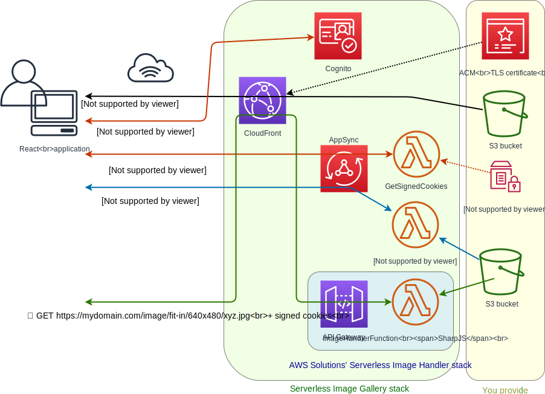
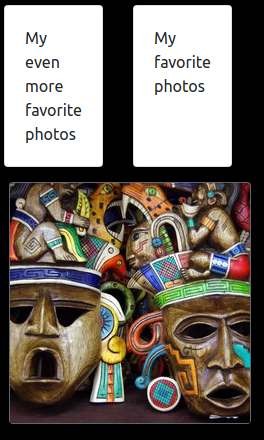
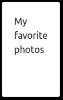
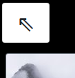
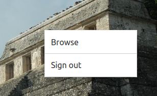

# Architecture



# Demo

Visit live demo at https://demo-gallery.aniskov.com/
Sign in there using user name ```user```, and password ```password```.

Upon signing in you will see following starting page.



# Using

The figure above shows so called browse mode when you see thumbnails of images and navigate folders.

Click subfolder tile to jump to content of the folder.



When you're in a subfolder you see arrow tile which will navigate you back to parent folder.



Click image thumbnail tile to start viewing photos full-screen.

While it is in full-screen image viewing mode use keyboard keys
```Arrow Left/Right/Up/Down```, ```Page Up/Down```, ```Space```, and ```Enter```,
or swipe left/right on touch screen devices,
to navigate forth and back through the gallery.

Click right mouse button, or long tap touch screen, to pop up context menu.

Use context menu to switch back to browse mode or sign out.



# Installing

## Prerequisites

1. Optional. Decide on public domain name for gallery's web UI. If omitted, gallery is accessible at CloudFront provided domain name cloudfront.net

1. Optional. Create an ACM public certificate for the domain name. See AWS Certificate Manager
[User Guide](https://docs.aws.amazon.com/acm/latest/userguide/gs-acm-request-public.html)

1. Decide on S3 bucket where you store your image files. That can be any existing bucket, or you create a new one. Optionally you provide prefix (path) which will make the application to filter non-matching files out.

1. Create the key to be used by CloudFront for signing cookies. (Read [_Create a key pair for a trusted key group_](https://docs.aws.amazon.com/AmazonCloudFront/latest/DeveloperGuide/private-content-trusted-signers.html#private-content-creating-cloudfront-key-pairs) in _CloudFront Developer Guide_.)
<br/>Run the following commands:
~~~sh
openssl genrsa -out private_key.pem 2048
openssl rsa -pubout -in private_key.pem -out public_key.pem
~~~

## Deploy the CloudFormation stack

1. Open [this template in your CloudFormation console](https://us-east-1.console.aws.amazon.com/cloudformation/home?region=us-east-1#/stacks/create/review?templateURL=https%3A%2F%2Faws-serverless-photo-gallery.s3.us-east-1.amazonaws.com%2Fserverless-photo-gallery-1.4.0.template&stackName=photo-gallery)

1. Change the console's region as needed.

1. Fill in the parameters.
<br/>To populate _Public Key for the CloudFront's signing_ parameter's value,
open file _public_key.pem_ in editor, copy the content, then paste to the input field.
Expect that there should be space characters instead of line breaks of the original file.

## Manual steps to be taken after deployment

1. Pay attention that stack you created got prefix _serverlessrepo-_ to its name automatically.
<br/>Create SSM parameter of Secure String type with name /_stack-name_/CLOUDFRONT_PRIVATE_KEY replacing _stack-name_ with your value, e.g. _serverlessrepo-photo-galery_.
<br/>Set its value to CloudFront private key (see Prerequisites) preserving newline characters.
You can do that with following AWS CLI command (don't forget to replace _stack-name_!) 
~~~sh
aws ssm put-parameter --type SecureString --name /_stack-name_/CLOUDFRONT_PRIVATE_KEY --value file://private_key.pem
~~~

2. Optional. If you chose to use a custom public domain name,
find stack in CloudFormation console,
on its Output tab find CloudFrontDistributionDomainName.
Configure your DNS to point domain name you chose to that.

1. Find stack in CloudFormation console. On its Output tab, find GalleryUrl.

1. Optional. Use Amazon Cognito Console to administer your users.
User database is in Cognito User Pool.
Find your User Pool id among CloudFormation stack's outputs.

# Credits

This works uses components of [Dynamic Image Transformation for Amazon CloudFront solution](https://github.com/aws-solutions/dynamic-image-transformation-for-amazon-cloudfront).

Demo gallery uses images by
[Free-Photos](https://pixabay.com/users/Free-Photos-242387/),
[Albert Dezetter](https://pixabay.com/users/DEZALB-1045091/),
[engin akyurt](https://pixabay.com/users/Engin_Akyurt-3656355/),
[Michelle Maria](https://pixabay.com/users/Mariamichelle-165491/),
[Jon Toy](https://pixabay.com/users/jtyoder-601591/),
[Peter Vandecaveye](https://pixabay.com/users/Connectingdots-919354/)
from [Pixabay](https://pixabay.com/).

***
Copyright 2019-2026 Maksim Aniskov MaksimAniskov@gmail.com Read LICENSE.txt